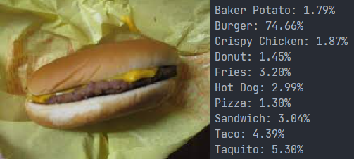

# Fast Food Classification

Use simple `timm` pipeline to classify 10 classes of fast food


## Environments and Libraries

- Python 3.10.9

Install requirements

``` bash
pip install --upgrade pip
pip install -r requirements.txt
```

## Data structure

Dataset can be found [here](https://www.kaggle.com/datasets/utkarshsaxenadn/fast-food-classification-dataset)

Data structure as below

```
.
├── data/
    ├── Test/
    │   ├── class 1
    │   │   ├── img 1
    │   │   ├── img 2
    │   │   ├── ...
    │   │   └── img n
    │   ├── class 2
    │   ├── ...
    │   └── class n
    ├── Train/ # Same as Test/
    └── Valid/ # Same as Test/
```

## Config Timm

Check model (with pretrained) available in `timm` with 

``` bash
python scripts/check_timm_models.py
```

In this repo I use `rexnet_100`

## Train

Modify config in `./cfg/cfg.yaml` and run

``` bash
python train.py --cfg ./cfg/cfg.yaml
```

After training, you will obtain `.pt` model weight

## Infer

Pretrained weight can be found [here](https://drive.google.com/file/d/1A9JCJW9IPAE93t7uV-vBCIg3COvCkQvC/view?usp=share_link), put pretrained weight or use your weight

Modify weight and image to infer in `./cfg/cfg.yaml` and run

``` bash
python infer.py
```

## Some results



## Reference

- [Fast Food Classification Dataset](https://www.kaggle.com/datasets/utkarshsaxenadn/fast-food-classification-dataset)
- [huggingface/pytorch-image-models](https://github.com/huggingface/pytorch-image-models)

## Citation

``` latex
@misc{han2020rexnet,
      title={ReXNet: Diminishing Representational Bottleneck on Convolutional Neural Network}, 
      author={Dongyoon Han and Sangdoo Yun and Byeongho Heo and YoungJoon Yoo},
      year={2020},
      eprint={2007.00992},
      archivePrefix={arXiv},
      primaryClass={cs.CV}
}
```
